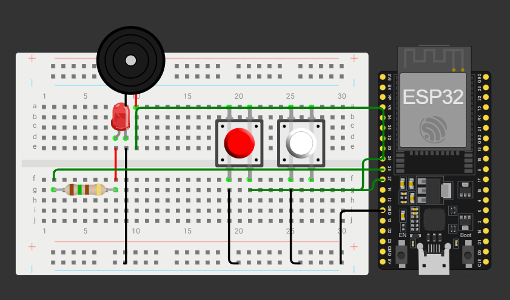

# Tradutor-morse
Sistema embarcado de um tradutor de código morse utilizando ESP32

##
O sistema funciona a partir da entrada de um botão que ao ser pressionado representa os pontos e traços do código morse. Esses sinais são processados pelo ESP32 que interpreta a sequência e converte em texto e o resultado é encaminhado através de um Bot no Telegram, o sistema também funciona no caminho contrário onde o usuário envia uma mensagem no Bot e o protótipo responde sonoramente a mensagem em morse através de um Buzzer.

##

Protótipo  executável no Wokwi: https://wokwi.com/projects/448445862859225089
